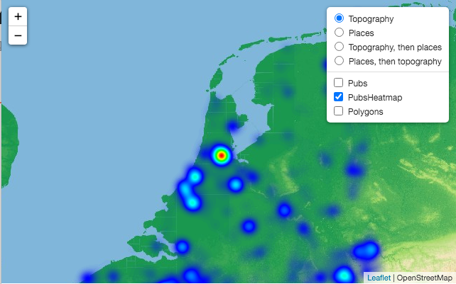

# MapServer Docker


Credits and inspiration for using Lighttp mainly from: <https://github.com/PDOK/mapserver-docker>

## TL;DR

```docker
docker build -t justb4/mapserver .
docker run -e MAPSERVER_CONFIG_FILE=/opt/mapserver/mapserver.conf --rm -d -p 8001:80 --name mapserver-example -v `pwd`/example:/opt/mapserver justb4/mapserver
docker stop mapserver-example
```


Or more compact using `docker compose` 

```

docker compose up --build [-d]

```

In browser open [example/index.html](example/index.html) to view layers (includes Heatmap).

Or pull from DockerHub: https://hub.docker.com/repository/docker/justb4/mapserver
Version tags follow the MapServer version, postfixed with the Docker Image version, e.g. `7.6.0-1`.

## Introduction

This project aims to fulfill these needs:

1. small-size Docker images
2. run with FastCGI and a small-footprint http server
3. Extensible for instance for Python MapScript apps
4. Quick build

For aspect 3): many MapServer Docker images use Docker multi-stage builds. Somehow this does not play nice when extending the image with
(MapScript) installs in a derived image like [segmentation faults](https://lists.osgeo.org/pipermail/mapserver-users/2020-June/081801.html). 

ad 1) and 2) Many MapServer Docker images are bulky since based on Ubuntu and Apache. Using `-slim` versions of Debian 
makes a good start. (Alpine Linux: too many challenges). Lighttpd is a proven smallsize HTTP server supporting FastCGI.

And finally ad 4) many MapServer Docker images do full-scale `Make` builds of MapServer and dependencies.
Though that allows fine-grained control over build-options and to use (patches for) latest versions,
a regular `apt-get install cgi-mapserver` seems to satisfy most uses. 

Main motivation for providing the N-th Docker Image for MapServer is the [MapGlow Heatmap Generator](https://github.com/justb4/mapglow).
This project was from around 2011, using Python MapScript to generate heatmaps. Struggling with various
existing Docker images, and not-too-good performance, I discovered that in the meantime MapServer offers
heatmap generation, named [Kernel Density Estimation](https://mapserver.org/output/kerneldensity.html#table-of-contents) which 
completely satisfies my purpose (heatmaps from GPS tracks). An example is included here: [example/index.html](example/index.html). Open in browser (no webserver needed)  to view.



## What will it do

It will create an MapServer application run with Lighttpd in which the map=... QUERY_STRING 'issue' is 'fixed'. 
This means that the MAP query parameter is removed from the QUERY_STRING.

## Docker image

The Docker image is a single build, no multi-staging. Size uncompressed around 300MB.

## Usage

### Build

```
docker build -t justb4/mapserver .

or 

./build.sh

```

### Configuration

Gotcha! The MapServer configuration conventions have been considerably changed starting with 8.0.0. See the [docs](https://mapserver.org/mapfile/config.html).
Where prior to v8 like in v7 a `MS_MAPFILE` pointing to a `.map` file was all that was needed, the 8.0.0 uses an enhanced scheme with 
a global `.conf` file. The env var `MAPSERVER_CONFIG_FILE` should be used. 
See the [example conf file](example/mapserver.conf) and [map file](example/example.map) here and the use of `MAPSERVER_CONFIG_FILE` in the
[docker compose file](docker-compose.yml) and examples below.

### Run

This image can be run straight from the commandline. A Docker Volume 
needs to be mounted on the container directory /opt/mapserver. The mounted Volume needs to contain at least one MapServer `*.map` file. 
The name of the mapfile will determine the URL path for the service.

```docker
docker run -e MAPSERVER_CONFIG_FILE=/opt/mapserver/mapserver.conf -d -p 8081:80 --name mapserver-example -v `pwd`/example:/opt/mapserver justb4/mapserver
```

Running the example above will create a service on 
the url <http://localhost:8081/?request=getcapabilities&service=wms>

The ENV variables that can be set are the following

```env
DEBUG
MIN_PROCS
MAX_PROCS
MAX_LOAD_PER_PROC
IDLE_TIMEOUT
MAPSERVER_CONFIG_FILE
PROJ_LIB
```

The ENV variables, with the exception of MAPSERVER_CONFIG_FILE have default values set in the [Dockerfile](Dockerfile).

## Example

When starting the container it will create a WMS & WFS service on the end-point

```html
http://localhost:8081?
```

But you may want to use other port-mappings (or none when you have a proxy like Traefik  in front).

### Example requests

```html
http://localhost:8081/?request=GetFeature&service=wfs&VERSION=2.0.0&typename=example:polygons&count=1

http://localhost:8081/?request=GetFeature&service=wfs&VERSION=2.0.0&typename=example:points&count=10

```

```html
http://localhost:8081/?SERVICE=WMS&VERSION=1.3.0&REQUEST=GetMap&BBOX=50,2,54,9&CRS=EPSG:4326&WIDTH=905&HEIGHT=517&LAYERS=polygons&STYLES=&FORMAT=image/png&DPI=96&MAP_RESOLUTION=96&FORMAT_OPTIONS=dpi:96&TRANSPARENT=TRUE

http://localhost:8081/?SERVICE=WMS&VERSION=1.3.0&REQUEST=GetMap&BBOX=51,4,53,5&CRS=EPSG:4326&WIDTH=905&HEIGHT=517&LAYERS=points&STYLES=&FORMAT=image/png&DPI=96&MAP_RESOLUTION=96&FORMAT_OPTIONS=dpi:96&TRANSPARENT=TRUE

```

```html
http://localhost:8081/?SERVICE=WMS&VERSION=1.3.0&REQUEST=GetFeatureInfo&BBOX=48.9306039592783506,0.48758765231731171,55.46504193821721884,12.33319204541738756&CRS=EPSG:4326&WIDTH=1530&HEIGHT=844&LAYERS=polygons&STYLES=&FORMAT=image/png&QUERY_LAYERS=polygons&INFO_FORMAT=text/html&I=389&J=537&FEATURE_COUNT=10
```

## Misc

### Why Lighttpd

Lighttpd runs as a single proces. Also all the routing configuration options aren't needed, 
because that is handled by the infrastructure/platform, like Kubernetes or Traefik. 
If one would like to configure some simple routing is still can be done in the lighttpd.conf.

### Used examples

* <https://github.com/PDOK/lighttpd-docker>
* <https://github.com/PDOK/mapserver-docker>
